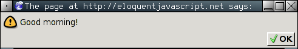
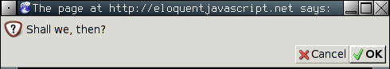
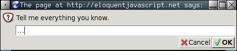

### Estructura del Programa

>Y mi corazón brilla rojo debajo de mi
delgada, translúcida piel y tienen que administrarme 10cc de JavaScript
para hacerme regresar (respondo bien a las toxinas en la sangre). ¡Hombre,
esa cosa te sacará de tus casillas!
>_why, Why's (Poignant) Guide to Ruby

En este capítulo, vamos a empezar a hacer cosas que realmente pueden ser llamadas _programación_. Vamos a ampliar nuestro conocimiento del lenguaje JavaScript, más allá de los sustantivos y fragmentos de oraciones que hemos visto hasta ahora, hasta el punto en que podamos expresar alguna prosa significativa.

### Expresiones y declaraciones

En el Capítulo 1, creamos algunos valores y después les aplicamos operadores para obtener nuevos valores. Crear valores de esta forma es una parte esencial de cada programa de JavaScript, pero esto es sólo una parte.

Un fragmento de código que produce un valor es llamado una _expresión_. Cada valor que se escribe literalmente (tal como `22` o `"psicoanálisis"`) es una expresión. Una expresión
entre paréntesis es también una expresión, como un operador binario aplicado a dos expresiones o un operador unario aplicado a una expresion.

Esto muestra parte de la belleza de una interfaz basada en el lenguaje. Las expresiones se pueden anidar en una forma muy similar a la forma de sub-frases en la que las lenguas humanas son anidadas, y las sub-frases pueden contener sus propias sub-frases, etc. Esto nos permite combinar expresiones para expresar cálculos arbitrariamente complejos.

Si una expresión corresponde a un fragmento de frase, una _declaración_ en JavaScript corresponde a una frase completa en lenguaje humano. Un programa es simplemente una lista de declaraciones.

El tipo más simple de declaración es una expresión con un punto y coma después de ella. Esto es un programa:

```
1;
!false;
```

Es un programa inútil, sin embargo. Una _expresión_ puede estar presente para sólo producir un valor, que puede entonces ser utilizado por la expresión que la contiene. Una _declaración_ existe por sí sola y que equivale a algo sólo si afecta al mundo. Podría mostrar algo en la
pantalla -que cuenta como cambiar el _mundo_ o podría cambiar el estado interno de la máquina de estados de manera que afectará las declaraciones que vienen despues de ella. Estos cambios se llaman _efectos colaterales_. Las declaraciones en el ejemplo anterior solo producen los valores `1` y `verdadero` y los desechan inmediatamente. Esto no deja ningún cambio en el mundo en absoluto. Al ejecutar el programa, nada observable sucede.

En algunos casos, JavaScript te permite omitir el punto y coma al final de una declaración. En otros casos, tiene que estar allí, o la siguiente linea será tratada como parte de la misma declaración. Las reglas para cuando se puede omitir con seguridad son algo complejas y propensas a errores. En este libro, cada declaración que necesite un punto y coma siempre será terminada por un punto y coma. Te recomiendo que hagas lo mismo en tus propios programas, al menos hasta que hayas aprendido más sobre sutilezas involucradas en omitir el punto y coma.

### Variables

¿Cómo mantiene un programa su estado interno? ¿Cómo recuerda algo? Hemos visto cómo producir nuevos valores de viejos valores, pero esto no cambia los valores antiguos, y el nuevo valor tiene que ser inmediatamente utilizado o se disipará de nuevo. Para atrapar y mantener los valores, JavaScript proporciona una cosa llamada _variable_.

```
var atrapado = 5 * 5;
```

Y eso nos da nuestra segunda clase de declaración.
La palabra especial(_palabra clave_ o _keyword_) `var` indica que esta frase va a definir una variable. Es seguida por el nombre de la variable y, si queremos dar de inmediato un valor, con un operador de `=` y una expresión.

La declaración anterior crea una variable llamada `atrapado` y se usa para retener el número que se produce al multiplicar 5 por 5.

Después de que una variable se ha definido, su nombre puede ser usado como una expresión. El valor de esa expresión es el valor que la variable alberga actualmente. He aquí un ejemplo:

```
var diez = 10;
console.log(diez * diez);
// → 100
```

Los nombres de variables pueden ser cualquier palabra que no sea una palabra clave (tal como `var`). Estos no pueden incluir espacios. Los dígitos también pueden ser parte de la variable nombre —`catch22` es un nombre válido, por ejemplo-, pero el nombre no debe comenzar con un dígito. Un nombre de variable no puede incluir puntuación, a excepción de los caracteres `$` y `_`.

Cuando una variable apunta a un valor, eso no quiere decir que está ligada a ese valor para siempre. El operador `=` se puede utilizar en cualquier momento en variables existentes para desconectarlas de su valor actual y apuntarlas a uno nuevo.

```
var tono = "claro";
console.log(tono);
// → claro
tono = "oscuro";
console.log(tono);
// → oscuro
```

Podrías imaginar  las variables como tentáculos, en lugar de la cajas. Estas no _contienen_ valores; los _agarran_; dos variables pueden referirse al mismo valor. Un programa sólo puede acceder  a los valores que todavía mantiene atrapados. Cuando necesitas recordar algo, haces crecer un tentáculo para agarrarlo o cambias unos de tus tentáculos existentes para agarrarlo.


Veamos un ejemplo. Para recordar el número de dólares que Luigi aún te debe, se crea una variable. Y luego, cuando te paga $35, le das a esta variable un valor nuevo.

```
var deudaDeLuigi = 140;
deudaDeLuigi = deudaDeLuigi - 35;
console.log(deudaDeLuigi);
// → 105
```

Cuando se define una variable sin darle un valor, el tentáculo no tiene nada que sostener, por lo que termina en el aire. Si preguntas por el valor de una variable vacía, obtendrás el valor `undefined` (indefinido).

Una sola declaración `var` puede definir múltiples variables. Las definiciones deben estar separadas por comas.

```
var uno = 1, dos = 2;
console.log(uno + dos);
// → 3
```

### Palabras clave y palabras reservadas

Palabras con un significado especial, como `var`, son _palabras clave_, y no pueden ser utilizadas como nombres de variables. También hay un número de palabras que son “reservadas para uso” en _futuras_ versiones de JavaScript. Estas también están oficialmente no permitidas como nombres de variables, aunque algunos entornos de JavaScript las permiten. La lista completa de palabras clave y palabras reservadas es bastante larga.

```
break case catch class const continue debugger
default delete do else enum export extends false
finally for function if implements import in
instanceof interface let new null package private
protected public return static super switch this
throw true try typeof var void while with yield
```

No te preocupes por memorizarlas, pero recuerda que esto podría ser el problema cuando una definición de variable no funcione como se esperaba.

### El entorno

La colección de variables y sus valores que existe en un momento dado se llama el _entorno_. Cuando un programa se pone en marcha, este entorno no está vacío. Siempre contiene variables que forman parte del lenguaje ((estándar)), y la mayoría del tiempo, contiene variables que proporcionan formas de interactuar con el sistema que lo contiene. Por ejemplo, en un _navegador_, existen variables y funciones para inspeccionar e influir en la página web cargada en ese momento y leer entrada del _ratón_ y del _teclado_.

### Funciones 

Una gran cantidad de los valores proporcionados en el entorno por defecto tienen el tipo _function_. Una función(function) es un pedazo de programa encerrado en un valor. Tales valores pueden ser _aplicados_ con el fin de ejecutar el programa envuelto. Por ejemplo, en un entorno de navegador, la variable `alert` contiene una función que muestra un pequeño cuadro de diálogo con un mensaje. Se utiliza como sigue:

```
alert("¡Good Morning!");
```



La ejecución de una función es denominada _invocar_, _llamar_, o _aplicar_ la función. Puedes llamar a una función poniendo _paréntesis_ después de una expresión que produce un valor de la función. Por lo general, se usa directamente el nombre de la variable que contiene la función. Los valores entre paréntesis se le pasan a el programa dentro de la función. En el ejemplo, la función `alert` utiliza la cadena que le damos como el texto que se mostrará en el cuadro de diálogo.
Los valores dados a las funciones se denominan _argumentos_. La función `alert` necesita solo uno, pero otras funciones pueden necesitar un número diferente o diferentes tipos de argumentos.

### La función console.log

La función `alert` puede ser útil para imprimir cuando estamos experimentando, pero quitar del camino todas esas pequeñas ventanas puede desesperarte. En ejemplos pasados, hemos usado `console.log` para devolver valores. La mayoría sistemas JavaScript (incluyendo a todos los navegadores web modernos y a Node.js) nos dan una función `console.log` que imprime sus argumentos en _algún_ dispositivo de salida de texto. En los navegadores la salida queda en la consola de JavaScript. Esta parte del navegador está escondida por defecto, pero la mayoría de los navegadores la abren cuando presionas F12 o, en Mac, cuando presionas Command-Option-I. Si esto no funciona, busca en los menús un item llamado "Consola Web" o "Herramientas de Desarrollador".


Cuando corras los ejemplos, o tu propio código, en las páginas de este libro, la salida de `console.log` será mostrada después del ejemplo, en vez de en la consola de JavaScript del navegador.

```
var x = 30;
console.log("el valor de x es", x);
// → el valor de x es 30
```

Aunque los nombres de variable no pueden contener el caracter punto, `console.log` claramente tiene uno. Esto es porque `console.log` no es una variable simple. Es en realidad una expresión que trae la propiedad `log` del valor mantenido por la variable `console`. Veremos que significa exactamente en el Capítulo 4.

### Valores de Retorno

Mostrar un cuadro de diálogo o escribir texto en la pantalla es un _efecto secundario_. Muchas funciones son útiles porque producen valores, y en ese caso, no necesitan tener un efecto secundario para ser útiles. Por ejemplo, la función `Math.max` toma un número indeterminado de números y regresa el más grande.

```
console.log(Math.max(2, 4));
// → 4
```

Cuando una función produce un valor, se dice que _regresa_ ese valor. Cualquier cosa que produce un valor es una expresión en JavaScript, lo que significa que puede ser usada dentro de expresiones más grandes. Aquí, una llamada a `Math.min`, que es lo opuesto a `Math.max`, es usada como entrada de un operador de suma:

```
console.log(Math.min(2, 4) + 100);
// → 102
```

El próximo capítulo explica como escribir tus propias funciones.

### Pedir información y confirmar

Los entornos de navegador tienen otras funciones más allá de `alert` para mostrar ventanas. Puedes preguntar al usuario una cuestión estilo OK/Cancelar usando `confirm`. Esto regresa un Booleano: `true` si el usuario hace click en OK y `false` si el usuario presiona en Cancelar.

```
confirm("¿Entonces, deberíamos?");
```



La función `prompt` puede ser usada para hacer una pregunta "abierta". El primer argumento
es la pregunta, el segundo es un texto con el que el usuario inicia. Se puede escribir una línea de texto en el cuadro de diálogo, y la función regresará este texto como una cadena.

```
prompt("Tell me everything you know.", "...");
```



Estas dos funciones no son usadas mucho en la programación web moderna, principalmente porque no tienes control sobre la forma en que las ventanas resultantes se verán, pero son útiles para programas de prueba y experimentos.

### Control de flujo

Cuando tu programa contiene más de una sentencia, las sentencias son ejecutadas (fácil de predecir), de arriba hacia abajo. Como un ejemplo básico, este programa tiene dos sentencias. La primera le pide un número al usuario, y la segunda, que se ejecuta después, muestra el _cuadrado_de ese número

```
var elNumero = Number(prompt("Dame un número", ""));
alert("Tú número es la raíz cuadrada de " + elNumero * elNumero);
```

La función `Number` convierte un valor a un número.
Necesitamos esa conversión porque el resultado de `prompt` es un valor de tipo cadena (string), y queremos un número. Hay funciones similares llamadas `String` y `Boolean` que convierten valores a estos tipos.

Aquí está la trivial representación esquemática de un flujo de control recto.


### Ejecución Condicional

Ejecutar sentencia en línea recta no es la íunica opción que tenemos. Una alternativa es la _ejecución condicional_, en dondne escogemos entre dos rutas diferentes basados en un valor Booleano, como el siguiente:


La ejecución condicional se escribe con la palabra clave `if` en JavaScript. En el caso sencillo, queremos que algo de código se ejecute si, y sólo si, cierta condición se cumple. Por ejemplo, en el programa previo, podríamos querer mostrar el cuadrado de la entrada sólo si la entrada es un número.

```
var elNumero = Number(prompt("Dame un número", ""));
if (!isNaN(elNumero))
  alert("Tu número es la raíz cuadrada de " + elNumero * elNumero);
```

Con esta modificación, si le das "queso", no se mostrará ninguna salida.

La palbra clave `if` ejecuta o salta una sentencia dependiendo del valor de una expresión Booleana. La expresión de decisión se escribe después de la palsbra clave, entre parántesis, seguida por una sentencia a ejecutar.

La función `isNaN` es una función estándar de JavaScript que regresa `true` sólo si el argumento que le diste es `NaN`. Resulta que la función Number regresa `NaN` cuando le das una cadena que no  “a menos que  `elNumero` no sea un número”.

A menudo no sólo tendrás código que se ejecute cuando una condición sea verdadera, sino también que maneje el otro caso. Este camino alternativo es representado por la segunda flecha en el diagrama. La palabra clave `else` puede ser usada, junto con `if`, para crear dos rutas de ejecución separadas y alternativas.

```
var elNumero = Number(prompt("Dame un número", ""));
if (!isNaN(elNumero))
  alert("Tu número es la raíz cuadrada de " + elNumero * elNumero);
else
  alert("Hey. ¿Por qué no me diste un número?");
```

Si tenemos más de dos caminos a escoger, varios pares de `if`/`else` pueden ser "encadenados". Aquí hay un ejemplo:

```
var num = Number(prompt("Dame un número", "0"));

if (num < 10)
  alert("Chico");
else if (num < 100)
  alert("Mediano");
else
  alert("Grande");
```

El programa primero checará sí `num` es menor que 10. Si lo es, escoge  ese camino, muestra `"Chico"` y termina. Si no lo es, toma el camino `else`, que en sí mismo contiene un segundo `if`. Si la segunda condición (`< 100`) se cumple, significa que el número está entre 10 y 100, y se muestra `"Mediano"`. Si no lo es, el segundo y último `else` es escogido.

El diagrama de flujo para este programa es algo así:


### bucles while y do

Piensa en un programa que imprima todos los números primos del 1 al 12. Una manera de escribirlo sería como sigue:

```
console.log(0);
console.log(2);
console.log(4);
console.log(6);
console.log(8);
console.log(10);
console.log(12);
```

Eso funciona, pero la idea de escribir un programa es trabajar _menos_, no más. Si necesitamos todos los números menores que 1,000, lo anterior sería imposible de trabajar. Lo que necesitamos es una forma de repetir algo de código. Esta forma de control de flujo es llamada _bucle_:


El control de flujo del bucle nos permite ir atrás a algún punto en el programa donde estábamos antes y repetirlo con nuestro actual estado del programa. Si combinamos esto con una variable contadora, podemos hacer algo así:


```
var number = 0;
while (number <= 12) {
  console.log(number);
  number = number + 2;
}
// → 0
// → 2
//   … etcetera
```

Una sentencia que comienza con la palabra clave `while` crea un bucle. Después de la palabra while viene una expresión en paréntesis y después una sentencia, muy parecido a el `if`. El bucle ejecuta la sentencia mientras la expresión produzca un valor que sea `true` cuando se convierte a un tipo Booleano.

En este bucle, queremos tanto imprimir el número, como sumar dos a nuestra variable. Cuando necesitamos ejecutar múltiples sentencias dentro de un bucle, lo encerramos en llaves (`{` y `}`). Las llaves hacen por las sentencias lo que los paréntesis hacen por las expresiones: las agrupan, haciéndolos valer por una sola sentencia. Una secuencia de sentencias encerradas en llaves es llamada un _bloque_.

Muchos programadores de JavaScript encierran cada cuerpo de un bucle `if` en llaves. Lo hacen en nombre de la consistencia y para evitar tener que añadir o quitar las llaves cuando el número de sentencias en el cuerpo cambie. En este libro escribiré la mayoría de los cuerpos de una sola sentencia sin bloques, porque valúo la brevedad. Tú eres libre de usar el estilo que prefieras.

La variable `número` demuestra la forma en que una variable puede dar seguimiento al progreso de un programa. Cada vez que el bucle se repite, `numero` se incrementa en `2`. Entonces, al principio de cada repetición, es comparada con el número `12` para decidir si el programa ha hecho todo el trabajo que tenía que hacer.

Como un ejemplo que hace realmente algo útil, podemos escribir un programa que calcula y mustra el valor de 2^10 (dos a la décima potencia). Usamos dos varianles: una para mantener el resultado y una para contar cuantas veces hemos multiplicado este resultado por dos. El bucle verifica si la segunda variable ha llegado a 10 y entonces actualiza las dos variables.

```
var result = 1;
var counter = 0;
while (counter < 10) {
  result = result * 2;
  counter = counter + 1;
}
console.log(result);
// → 1024
```

El contador pudo también empezar en `1` y verificar que el contador sea  `<=10`, pero, por razones que se aclararán en el Capítulo 4, es una buena idea acostumbrarse a contar desde 0.

El bucle `do` es una estructura de control similar al bucle `while`. Se diferencia en sólo un punto: un bucle `do` siempre ejecuta su cuerpo por lo menos una vez y empieza a verificar si debería parar sólo después de la primera ejecución. Para reflejar esto, la condición aparece después del cuerpo del bucle:

```
do {
  var yourName = prompt("Who are you?");
} while (!yourName);
console.log(yourName);
```

Este programa te obligará a introducir un nombre. Preguntará una y otra vez hasta que obtenga algo que no sea una cadena vacía. Aplicar el operador `!` convierte un valor a Booleano negándolo y todas las cadenas excepto `""` se convierten a `true`. Esto significa que el bucle continúa corriendo hasta que des un nombre que no sea una cadena vacía.

#### Indentando código

Probablemente has notado los espacios que pongo en frente de algunas sentencias. En JavaScript, no son requeridos, la computadora aceptara el programa bien sin ellos. De hecho, incluso los saltos de línea en los programas son opcionales. Puedes escribir un programa en una sola línea si así lo prefieres. El rol de la indentación dentro de los bloques es hacer notar la estructura del código. En código complejo, en dónde nuevos bloques son abiertos dentro de otros bloques, puede ser difícil de ver en dónde termina uno y empieza otro. Con la indentación correcta, la forma visual del programa se corresponde con la forma de los bloques dentro de él. A mí me gusta usar dos espacios por cada bloque abierto, pero los gustos varían; algunas personas usan cuatro espacios, y algunas otras usan el carácter `tab`.

### Bucles for

Muchos bucles siguen el patrón de los ejemplos previos del `while`. Primero, una variable _“contador”_ es creada para dar seguimiento al progreso del bucle. Entonces viene un bucle `while`, cuya expresión condicional normamelte verifica si el contador ha alcanzafo cierto límite. En el final del cuerpo del bucle, el contador es actualizado para dar seguimiento al progreso.

Debido a que este patrón es tan común, JavaScript y los lenguajes similares proveen una forma un poco más corta y facil de entender, el bucle `for`.

```
for (var number = 0; number <= 12; number = number + 2)
  console.log(number);
// → 0
// → 2
//   … etcetera
```

Este programa equivale exactamente al ejemplo anterior. El único cambio es que todas las _declaraciones_ que se refieren al "estado" del bucle están ahora agrupadas entre ellas. 

Los paréntesis posteriores a una palabra clave `for` deben contener dos punto y coma. La primera parte antes del primer punto y coma _inicializa_ el bucle, por lo general definiendo la variable. La segunda parte es la expresión que _comprueba_ si el bucle debe continuar. La parte final _actualiza_ el estado del bucle después de cada repetición. La mayoría de las veces, esto es más corto y claro que una construcción `while`.  

Aquí el código que computa 2^10, usando `for` en lugar de `while`:
```
var result = 1;
for (var counter = 0; counter < 10; counter = counter + 1)
  result = result * 2;
console.log(result);
// → 1024
```

Nota que aunque ningún bloque está abierto con `{`, la declaración en el bucle está aún sangrada con dos espacios para hacer claro que _"pertenece"_ a la línea anterior.

### Deteniendo un bucle  

Hacer que la condicion pruduzca `false` en el bucle no es la única forma en que un bucle puede terminar. Hay una declaración especial llamado `break` que tiene el efecto de saltar inmediatamente fuera del bucle cerrado. 

Este programa ilustra la sentencia `break`. Encuentra el primer número que es mayor o igual a 20 y divisible entre 7.

```
for (var current = 20; ; current++) {
  if (current % 7 == 0)
    break;
}
console.log(current);
// → 21
```

Usando el operador (`%`) es una forma fácil de comprobar si un número es divisible entre otro número. Si es así, el resto de su división es cero. 

El constructor `for` en el ejemplo no tiene una parte que revise el fin del bucle. Esto significa que el bucle nunca se detendrá a menos que la declaración `break` se ejecute desde adentro.

Si tu dejaras fuera la declaración `break` o escribieras accidentalmente una condición que siempre produce verdadero, tu programa quedará atorado en un _bucle infinito_. Un programa atorado en un bucle infinito nunca terminará de correr, lo que normalmente es algo malo.  

Si creas un bucle infinito en uno de los ejemplos de estas páginas, normalmente el navegador te preguntara si quieres detener la secuencia de comandos después de unos cuantos segundos. Si eso falla, tendrás que cerrar la pestaña en la que estás trabajando, o en algunos navegadores cerrarlo completamente, con el fin de recuperarlo.

La palabra clave `continue` es similar a `break`, en esta influye en el progreso de un bucle. Cuando `continue` se encuentra dentro del cuerpo del bucle, el control salta fuera del cuerpo y continúa con la siguiente repetición del bucle.

### Actualizar variables en breve  

Particularmente cuando se hace un bucle, un programa a menudo necesita "actualizar" una variable para mantener un valor basado en el valor previo de esa variable. 

```
counter = counter + 1;
```

JavaScript provee un atajo a esto:

```
counter += 1;
```

Atajos similares trabajan para muchos otros operadores, como `resultado *= 2` para doblar el `resultado` o `contador -= 1` para contar descendente.

Esto nos permite acortar un poco más nuestro ejemplo de conteo.

```
for (var number = 0; number <= 12; number += 2)
  console.log(number);
```

Para `contador += 1` y `contador -= 1`, existen incluso equivalentes más cortos: `contador++` y `contador--`.

### Enviando en un valor con switch

Es común que el codigo se vea así:  

```
if (variable == "value1") action1();
else if (variable == "value2") action2();
else if (variable == "value3") action3();
else defaultAction();
```

Hay un constructor llamado switch que está pensado para funcionar como un "despachador" en una manera más directa. Desafortunadamente, la sintaxis que JavaScript usa para esto (lo cual hereda de lenguajes de programación como C/Java) que es de alguna manera menos eficiente que una cadena de declaraciones if que a menudo se ve mejor. Aquí un ejemplo:

```
switch (prompt("What is the weather like?")) {
  case "rainy":
    console.log("Remember to bring an umbrella.");
    break;
  case "sunny":
    console.log("Dress lightly.");
  case "cloudy":
    console.log("Go outside.");
    break;
  default:
    console.log("Unknown weather type!");
    break;
}
```

Podrás poner cualquier número de etiquetas `case` dentro del bloque abierto por `switch . El programa saltará a la etiqueta que corresponde al valor que switch dió o el default si no coincide el valor. Esto empieza a ejecutar declaraciones allí, aunque estén bajo otra etiqueta, hasta que alcancen una declaración `break`.  En algunos casos, como el del caso `"sunny"` en el ejemplo, esto puede ser usado para compartir algo de código entre casos (esto recomienda ir fuera por ambos climas soleado y nuboso). Pero ten cuidado: es fácil olvidar un `break`, lo cual causará que el programa ejecute código que no quieres que se ejecute.

### Mayúsculas 

Los nombres de variables no debe contener espacios, sin embargo es común ayudarse usando múltiples palabras que claramente describan lo que la variable representa. Estas son casi tus única opciones para escribir un nombre de variable con varias palabras en ella.  

```
fuzzylittleturtle
fuzzy_little_turtle
FuzzyLittleTurtle
fuzzyLittleTurtle
```

El primer estilo puede ser difícil de leer. Personalmente, Me gusta como se ven los guiones bajos, sin embargo ese estilo es un poco complicado de escribir. Las funciones comunes JavaScript, y la mayoría de programadores JavaScript, siguen el último estilo - ellos ponen en mayúsculas cada palabra excepto la primera. No es difícil acostumbrase a cosas pequeñas como esta, y escribir código con estilos de nombres mixtos puede ser tedioso de leer, así que nosotros sólo seguiremos este convención.

En algunos casos, como en la función `Number`, la primera letra de una variable es también mayúscula. Esto se hizo para señalar esta función como un constructor. Lo que es un constructor vendrá claramente en el capítulo 6. Por ahora, lo importante es no estar preocupado por esta aparente falta de consistencia.

### Comentarios

A menudo, el código crudo no transmite toda la información que quieres que un programa transmita a los lectores humanos, o transmite en una forma como encriptada que la gente no puede entender. En otros momentos, te puedes sentir poético o queriendo incluir algunos pensamientos como parte de tu programa. Esto es para lo que son los _comentarios_. 

Un comentario es un pedazo de texto que es parte de un programa pero es completamente ignorado por la computadora. JavaScript tiene dos maneras de escribir comentarios. Para escribir un comentario de una sola línea, puedes usar dos diagonales (`//`) y el texto del comentario después.  

```
var accountBalance = calculateBalance(account);
// It's a green hollow where a river sings
accountBalance.adjust();
// Madly catching white tatters in the grass.
var report = new Report();
// Where the sun on the proud mountain rings:
addToReport(accountBalance, report);
// It's a little valley, foaming like light in a glass.
```

Un comentario `//` va únicamente al final de la línea. Una sección de texto entre `/*` y `*/` será ignorada, sin tener en cuenta lo que contenga. Esto es a menudo útil para agregar bloques de información acerca de un archivo o un trozo de programa.

```
/*
 I first found this number scrawled on the back of one of
 my notebooks a few years ago. Since then, it has often
 dropped by, showing up in phone numbers and the serial
 numbers of products that I've bought. It obviously likes
 me, so I've decided to keep it.
*/
var myNumber = 11213;
```

### Resumen

Ahora tu sabes que un programa está construido por declaraciones, las cuales por si mismas contienen más declaraciones.
Las declaraciones tienden a contener expresiones, las cuales en si mismas pueden ser construidas desde expresiones más pequeñas.

Poner declaraciones después de otra, te da un programa que es ejecutado de arriba a abajo. Puedes ingresar interrupciones en el control de  flujo utilizando declaraciones condicionales (if, else, y switch) y de bucle (while, do, y for).

Las variables pueden ser usadas para archivar pedazos de datos dentro de un nombre, y son útiles para rastrear estados en tu programa.
El ambiente es el conjunto de variables que son definidas.
Los sistemas JavaScript siempre ponen un número de variables estándar útiles a tu ambiente.

Las funciones son valores especiales que encapsulan un pedazo de programa.
Puedes invocarlas escribiendo `nombreDeFuncion(argumento1,argumento2)`.
Así como una llamada a función es una expresión, y puede producir un valor.

### Ejercicios

Si no estás seguro de como probar tus soluciones a los ejercicios, dirigete a la introducción. 

Cada ejercicio comienza con una descripción de un problema. Léelo y trata de resolver el ejercicio. Si te encuentras en problemas, considera leer los consejos después del ejercicio. Las soluciones completas a los ejercicios no están incluidas en este libro, pero puedes encontrarlas en línea en http://eloquentjavascript.net/code. Si quieres aprender algo de los ejercicios, recomiendo buscar las soluciones únicamente después de resolver el ejercicio, o al menos después de que hayas tratado lo más duro posible y que tengas un ligero dolor de cabeza.


### Buclear un triangulo  

Escribe un bucle que haga siete llamadas a `console.log` para mostrar el siguiente triangulo:  

```
#
##
###
####
#####
######
#######
```

Puede ser útil saber que puedes encontrar el largo de la cadena de texto escribiendo .lenght después de esta.

```
var abc = "abc";
console.log(abc.length);
// → 3
```
La mayoría de los ejercicios contienen un pedazo de código que puedes modificar para resolver el ejercicio. Recuerda que puedes clickear bloques de código para editarlos.

```
// Your code here.
```

!!Consejo!!

Puedes comenzar con un programa que simplemente imprima la salida de números 1 al 7, los cuales puedes derivar haciendo una pocas modificaciones al ejemplo de impresión de número par dado antes en este capítulo, donde el bucle `for` fue presentado.

Ahora considera la equivalencia entre números y cadenas de texto de caracteres de número. Puedes ir de 1 a 2 agregando 1 (`+= 1`). Puedes ir de `"#"` a `"##"` agregando el caracter (`+= "#"`). Por lo tanto, tu solución puede estar cerca del programa _number-printing_. 

### FizzBuzz

Escribe un programa que use console.log para imprimir todos los números del 1 al 100, con dos excepciones. Para números divisibles por 3, imprime "Fizz" en lugar del número, y para números divisibles en 5 (y no 3), imprime "Buzz" en su lugar.  

Cuando tengas trabajando eso, modifica tu programa para imprimir `"FizzBuzz"`, para números que son divisibles por ambos 3 y 5 (y que aún imprima `"Fizz"` o `"Buzz"` para números divisibles por únicamente uno de esos).

(Esto es en realidad una pregunta de entrevista que ha sido elaborada para quitar un significante porcentaje de candidatos a programador. Entonces si lo resuelves, puedes sentirte bien contigo mismo.)  

```
// Your code here.
```

!!Consejo!!


Ir sobre los números es claramente un trabajo de bucle, y seleccionar que se imprime es una cuestión de ejecución condicional. Recuerda el truco de usar un operador de resultado (`%`) para revisar si un número es divisible por otro número (tiene un resultado cero).

En la primera versión, existen tres posibles resultados para cada número, entonces tienes que crear una cadena de `if`/`else if`/`else`.

La segunda versión del programa tiene un solución directa e inteligente. La manera simple es agregar otra "rama" para precisamente probar la condición dada. Para el método inteligente, construye una cadena de texto conteniendo la palabra o palabras a salir, e imprime ya sea esta palabra o el número si es que no hay una palabra, potencialmente haciendo uso del operador elegante `||`.


### Tablero de ajedréz

Escribe un programa que cree una cadena de texto que represente una rejilla de 8x8, usando caracteres _newline_ para separar líneas. A cada posición de la rejilla ya sea un espacio o un caracter "#". Los caracteres deberían formar un tablero de ajedrez.

Pasando esta cadena de texto a `console.log` debería mostrar algo como esto:  

```
 # # # #
# # # #
 # # # #
# # # #
 # # # #
# # # #
 # # # #
# # # #
```

Cuando tienes un programa que genera este patrón, define una variable `size = 8` y cambia el programa de modo que este trabaje para cualquier tamaño, imprimiendo una rejilla de ancho y alto dado. 

```
// Your code here.
```

!!Consejo!!

La cadena de texto puede ser construida comenzando con un (`""`) vacío y repetidamente agregando caracteres. Un caracter newline es escrito "`"\n"`.  

Usa `console.log` para inspeccionar la salida de tu programa.

Para trabajar con dos dimensiones, necesitarás un bucle dentro de un bucle. Pon llaves alrededor de los cuerpos de ambos bucles para hacer fácil de ver donde empiezan y terminan. Trata correctamente de identificar los cuerpos. El orden de los bucles deben seguir el orden en cual construiremos la cadena de texto (línea a línea, izquierda a derecha, arriba a abajo). Entonces para que el bucle exterior maneje las líneas y el bucle interior maneje los caracteres en una línea.

Necesitas dos variables para rastrear tu progreso. Para saber si poner un espacio o un signo de número a una determinada posición, puedes probar si la suma de los dos contadores es par (`%2`).

Poniendo fin a una línea agregando un caracter newline sucede después que la línea ha sido construida, por lo tanto haz esto después del bucle pero dentro del otro bucle.