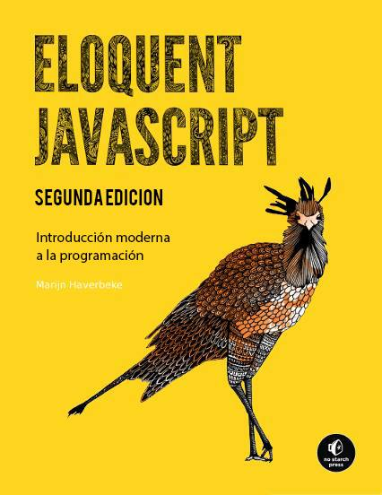

# Eloquent Javascript en Español

# Summary

* [Introducción](00_intro.md)
* [1. Valores, Tipos y Operadores](01_values.md)
* [2. Estructura del Programa](02_program_structure.md)
* [3. Funciones](03_functions.md)
* [4. Estructuras de Datos: Objetos y Arreglos](04_data.md)
* [5. Funciones de Orden Superior](05_higher_order.md)
* [6. La Vida Secreta de los Objetos](06_object.md)
* [7. Proyecto: Vida Electronica](07_elife.md)