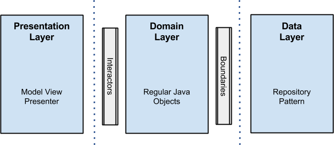
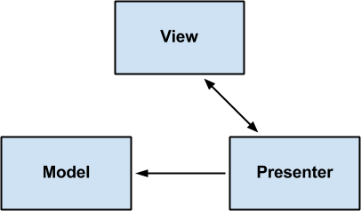
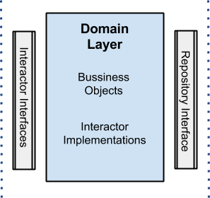

# Arquitecturando Android... La manera limpia

Durante los últimos meses y después de tener amistosas discusiones en Tuenti con colegas como @pedro_g_s y @ flipper83 (por cierto 2 tipos rudos en el desarrollo de Android), he decidido que era un buen momento para escribir un artículo sobre la arquitectura de aplicaciones android. El propósito es mostrarles un pequeño enfoque que he tenido en mente los últimos meses, además de todas las cosas que he aprendido de investigar e implementarlas.

## Empezando  

Sabemos que la escritura de software de calidad es difícil y complejo: No es sólo satisfacer los requerimientos, también debe ser robusto, mantenible, comprobable, y lo suficientemente flexible como para adaptarse al crecimiento y al cambio. Aquí es donde "la arquitectura limpia" se acerca y podría ser un buen método para usar en el desarrollo de cualquier aplicación de software. La idea es simple: arquitectura limpia significa un conjunto de prácticas que producen los sistemas que son:

- Independiente de Frameworks.
- Testeable
- Independiente de la interfaz de usuario.
- Independiente de la base de datos.
- Independiente de cualquier agente externo.

No es imprescindible utilizar sólo 4 círculos (como se puede ver en la imagen), ya que son únicamente esquemáticos, pero se debe tener en cuenta la regla de dependencia: Las dependencias de código fuente sólo pueden apuntar hacia adentro y nada en un círculo interior pueden saber nada en absoluto acerca de algo en un círculo exterior.

Aquí un vocabulario que es relevante para familiarizarse y comprender este enfoque de una mejor manera:

- Entidades: Son los objetos de negocio de la aplicación.
- Casos de Uso: Estos casos de uso orquestan el flujo de datos hacia y desde las entidades. También llamados interactores.
- Adaptadores de Interfaz: Este conjunto de adaptadores convierten datos de el formato mas conveniente para los casos de uso y las entidades. Presentadores y controladores se incluyen aquí.
- Frameworks y Controladores: Esto es donde van todos los detalles: Interfaz de Usuario, herramientas, Frameworks, etc. 

Para una mejor y más amplia explicación, referirse a este artículo o este vídeo.

## Nuestro Escenario

Voy a comenzar con un escenario simple para que funcione: basta con crear una pequeña aplicación que muestra una lista de amigos o usuarios recuperados de la nube y, al hacer clic en cualquiera de ellos, se abrirá una nueva pantalla que muestra más detalles de ese usuario. Dejo un vídeo para que pueda tener el panorama general de lo que estoy hablando:

## Arquitectura Android 

El objetivo es la separación de las preocupaciones manteniendo las reglas de negocio sin saber nada en absoluto sobre el mundo exterior, por lo tanto, se pueden probar sin ningún tipo de dependencia a cualquier elemento externo. Para lograr esto, mi propuesta _se trata de romper el proyecto en 3 capas diferentes_, en los que cada una tiene su propio propósito y funciona separada de las demás. Vale la pena mencionar que cada capa utiliza su propio modelo de datos por lo que esta independencia puede ser alcanzada (verá en el código que se necesita un asignador de datos con el fin de lograr la transformación de datos, un precio a pagar si no quiere cruzar la Utilización de su modelos en toda la aplicación).  He aquí un esquema para que pueda ver cómo se ve así:

NOTA: Yo no utilizo ninguna librería externa (excepto GSON para parsear los datos JSON y junit, Mockito, robolectric y espresso para las pruebas). La razón era porque hace un poco más claro el ejemplo. De todos modos, no dude en añadir ORMs para el almacenamiento de datos en disco o cualquier framework de inyección de dependencias o cualquier herramienta o biblioteca con la que estes familiarizado, que podría hacer tu vida más fácil. (Recuerde que reinventar la rueda no es una buena práctica). 

## Capa de Presentación 

Es aquí, donde la lógica relacionada con las vistas y las animaciones suceden. Esto no usa más que un Modelo Vista Presentación (MVP de ahora en adelante), pero tú puedes usar cualquier otro patrón como MVC o MVVM.  No entraré en detalles sobre esto, pero aquí los fragmentos y las actividades son solo vistas, no hay lógica dentro de ellos más que lógica de interfaz de usuario, y esto es donde se realizan todas las cosas de renderizado. Los presentadores de esta capa se componen con interactores(casos de uso) que realizan el trabajo en un nuevo hilo fuera del hilo de interfaz de usuario de Android, y regresan usando un callback con los datos que se representaran en la vista. 

Si quieres un ejemplo bueno de eficaz interfaz de usuario de Android que utiliza MVP y MVVM, echa un vistazo a lo que mi amigo Pedro Gómez ha hecho.

## Capa de Dominio 

Las reglas de negocio van aquí: Toda la lógica de negocio sucede en esta capa. Con respecto al proyecto android, podrás ver todos los interactores (casos de uso) implementados aquí también.   Esta capa es un módulo de Java puro sin ninguna dependencia Android.   Todos los componentes externos usan interfaces cuando se conectan a los objetos de negocio.

NOTA: Un caso de uso es una descripción de los pasos o las actividades que deberán realizarse para llevar a cabo algún proceso. Los personajes o entidades que participarán en un caso de uso se denominan actores. En el contexto de ingeniería del software, un caso de uso es una secuencia de interacciones que se desarrollarán entre un sistema y sus actores en respuesta a un evento que inicia un actor principal sobre el propio sistema.

## Capa de Datos

Todos los datos necesarios para la aplicación vienen de esta capa a través de una implementación UserRepository (la interfaz está en la capa de dominio) que utiliza un patrón de repositorio con una estrategia que, a través de una fábrica, recoge diferentes fuentes de datos en función de ciertas condiciones. Por ejemplo, cuando traemos un usuario por id, se seleccionará la fuente de datos de caché de disco si el usuario ya existe en la memoria caché, de lo contrario se consultará la nube para recuperar los datos y luego guardarlo en la memoria caché de disco. La idea detrás de todo esto es que el origen de datos es transparente para el cliente, no le importa si los datos proviene de memoria, disco o la nube, la única verdad es que los datos llegarán y serán conseguidos.

NOTA: En términos de código he puesto en práctica una manera muy sencilla y primitiva de cache de disco utilizando el sistema de archivos y preferencias android, que fue para el propósito de aprendizaje. Recuerda una vez más que no se debe reinventar la rueda si hay librerías existentes que realizan estas tareas de una mejor manera. 

## Manejo De Errores 

Este es siempre un tema de debate y podría ser estupendo si comparte sus soluciones aquí. Mi estrategia fue utilizar callbacks, por lo tanto, si algo sucede en el repositorio de datos, por ejemplo, el callback tiene 2 métodos onResponse() y onError(). La última encapsula excepciones en una clase contenedora llamado "ErrorBundle": Este enfoque trae algunas dificultades por que hay callbacks encadenados, uno tras otro hasta que el error va a la capa de presentación para ser presentado. La legibilidad del código podría ser un poco comprometida. Por otro lado, podría haber implementado un sistema de bus de eventos que lanza eventos si algo malo sucede, pero este tipo de solución es como usar un GOTO, y, en mi opinión, a veces puede perderse cuando estás suscrito a varios eventos si no se controla tan de cerca.

## Pruebas

En cuanto a las pruebas, he optado por varias soluciones dependiendo de la capa:

- Capa de presentación: utiliza la instrumentación android y espresso para la integración y pruebas funcionales.  
- Capa de Dominio: JUnit más Mockito para las pruebas unitarias se utilizó aquí.  
- Capa de datos: Robolectric (ya que esta capa tiene dependencias android) más junit más Mockito para las pruebas de integración y de unidad.

## Muéstrame el código

Se que podrías estarte preguntando ¿donde está el código, verdad? Bien  aquí está el enlace de [github](https://github.com/android10/Android-CleanArchitecture) donde encontrará lo que he hecho. Acerca de la estructura directorio, algo que mencionar es que las diferentes capas son presentadas usando módulos:

- Presentación: Se trata de un módulo de android que representa la capa de presentación.  
- Dominio: Un módulo de Java sin dependencias de android. 
- Datos: Un módulo de android de donde se recuperan todos los datos.  
- Prueba de datos: prueba la capa de datos.   Debido a algunas limitaciones cuando se utiliza Robolectric, tuve que utilizarlo en un módulo separado de Java.

## Conclusión

Como dice el tío Bob, "La arquitectura es sobre la intención, no sobre frameworks" y estoy totalmente de acuerdo con esta afirmación. Por supuesto, hay muchas maneras de hacer las cosas (diferentes implementaciones) y estoy bastante seguro de que tú (como yo) nos enfrentamos a muchos desafíos todos los días, pero mediante el uso de esta técnica, se asegura de que su aplicación será:

- Fácil de mantener.  
- Fácil de probar.  
- Muy unido.  
- Desacoplado. 

Como una conclusión, totalmente te recomiendo tratarlo y ver y compartir tus resultados y experiencias, así como cualquier otro enfoque que hayas encontrado que funciona mejor: sabemos que la mejora continua es siempre una cosa muy buena y positiva.   Espero que hayas encontrado este artículo útil y, como siempre, cualquiera retroalimentación es bien venida.